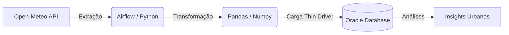

# 🛰️ Monitoramento de Densidade Urbana via Sensoriamento Remoto

> Projeto de Engenharia de Dados (Global Solution) focado na ingestão, processamento e análise de dados georreferenciados para otimização da mobilidade urbana.

## 📌 Sobre o Projeto
O crescimento desordenado das metrópoles exige soluções inteligentes para o planejamento urbano. Este projeto implementa um pipeline de dados (ETL) 100% automatizado que consome dados meteorológicos e de superfície em tempo real, gerando um índice de densidade urbana e calor. 

O objetivo é fornecer uma base de dados sólida e estruturada para subsidiar tomadas de decisão na gestão de frotas de transporte público e alocação de infraestrutura.

## 🏗️ Arquitetura do Pipeline
A esteira de dados foi desenhada para ser escalável e resiliente, utilizando **Apache Airflow** rodando em **Docker** para a orquestração do fluxo:

1. **Extração:** Consumo de dados via Open-Meteo API (Sem necessidade de autenticação).
2. **Staging:** Armazenamento temporário do JSON bruto em diretório local (`/tmp`).
3. **Transformação:** Limpeza de nulos, filtros geográficos e enriquecimento categórico utilizando Pandas e Numpy.
4. **Carga:** Inserção em lote (Batch) em um Data Warehouse no Oracle Database.
5. **Análise:** Extração de insights através de consultas SQL.

2. Configurando o Ambiente
Clone este repositório e configure as credenciais do banco no arquivo satelite_pipeline.py (linha correspondente à conexão oracledb.makedsn).

3. Subindo o Cluster Airflow
Abra o terminal na raiz do projeto e execute:

# Inicializa o banco de metadados do Airflow
docker compose up airflow-init

# Sobe todos os serviços (Scheduler, Webserver, Worker)
docker compose up -d

4. Executando a DAG
 1. Acesse http://localhost:8080 no seu navegador.
 2. Login/Senha: airflow / airflow.
 3. Procure a DAG pipeline_satelite_densidade_urbana.
 4. Ative a DAG (Unpause) e clique no botão de Trigger (Play).
 5. Acompanhe a execução pela aba Graph.

👨‍💻 Autores
Projeto desenvolvido para a disciplina de Big Data Architecture & Data Integration - FIAP (Engenharia de Software).

- Enricco Rossi de Souza Carvalho Miranda - RM: 551717
- Gabriel Marquez Trevisan - RM: 99227
- Guilherme Silva dos Santos - RM: 551168
- Danilo Urze Aldred - RM: 99465
- Laura Claro Mathias - Rm: 98747
